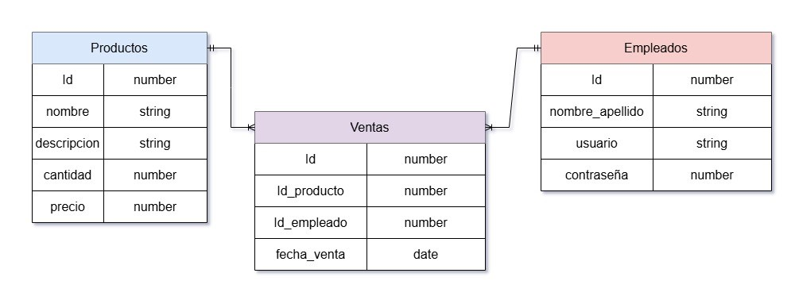

## Gestion de Registro Ventas por Empleado

- Instalar las dependencias

```bash
npm i
```

## Diagrama del modelo



## Employees

El modelo de los empleados es en donde se guardan los datos personales y las credenciales de los empleados.

## Products

El modelo de los productos es en donde se guardan los datos de los productos, como su nombre, una descripción, su precio y el stock disponible.

## Sales

El modelo de ventas es en donde quedan registradas las ventas realizadas, con los productos que se compraron y el empleado a cargo de la venta.
